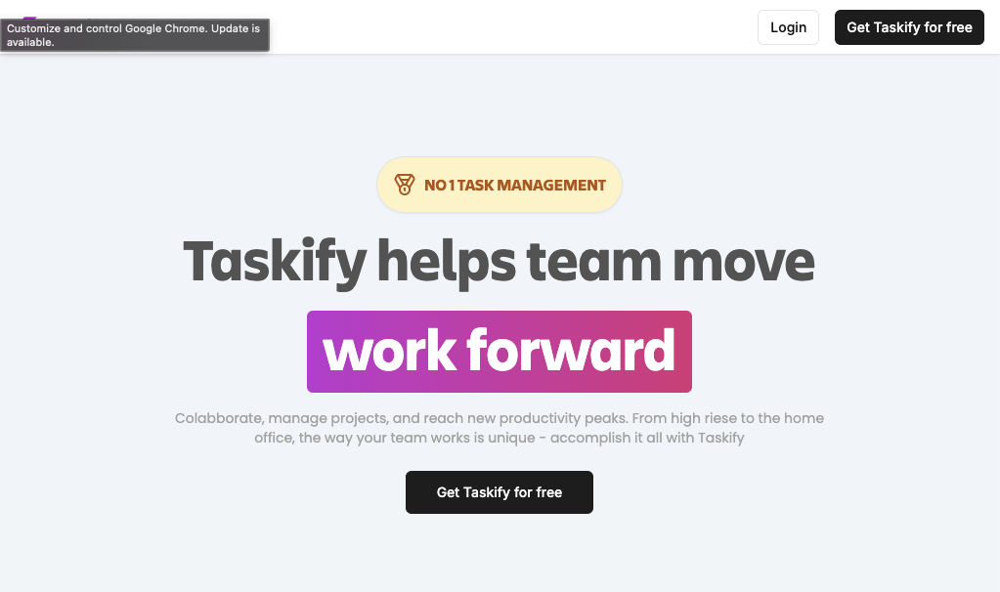
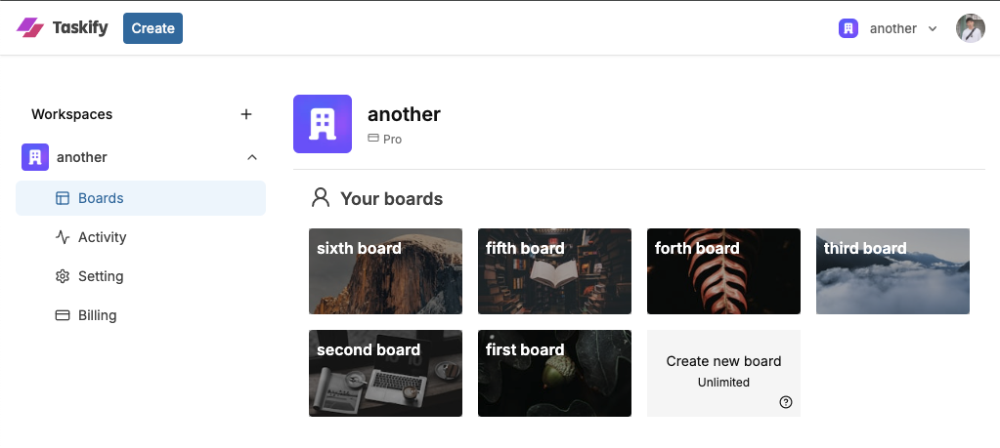
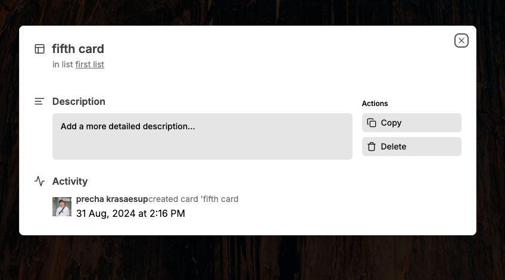
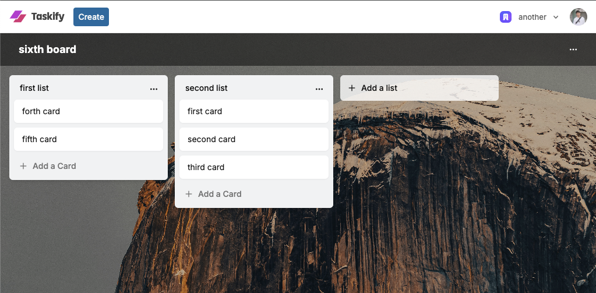

# Taskify

Welcome to Taskify, a Task management application that helps teams and individuals organize their work efficiently. With a sleek and intuitive interface, Taskify makes project management simple and enjoyable.

## Features

### User Authentication

- **Clerk Authentication**: Secure user authentication system using Clerk.
- Sign up and log in to your personal account with Clerk's seamless integration.

### Organizations & Workspaces

- Create and manage multiple organizations.
- Organize your projects within workspaces specific to each organization.

### Boards

- **Board Creation**: Create boards to organize tasks within a workspace.
- **Random Beautiful Cover Images**: Leverage Unsplash API to add stunning cover images to your boards.
- **Activity Log**: Track all board activities within the organization.
- **Rename & Delete**: Easily rename or delete boards.
- **Board Limit**: Each organization has a board limit.
- **Stripe Subscription**: Upgrade your organization to unlock unlimited boards.

### Lists

- **List Creation**: Add lists to organize tasks within a board.
- **Rename & Delete**: Rename or delete lists as needed.
- **Drag & Drop Reorder**: Drag and drop lists to reorder them.
- **Copy Lists**: Duplicate lists for easier task management.

### Cards

- **Card Creation**: Add cards within lists to represent tasks.
- **Description**: Add detailed descriptions to cards.

- **Rename & Delete**: Rename or delete cards.
- **Drag & Drop Reorder**: Drag and drop cards to reorder them.
- **Copy Cards**: Duplicate cards as needed.
- **Card Activity Log**: Keep track of all activities related to a card.

### Landing Page

- Elegant landing page to introduce and promote Taskify.

## Tech Stack

- **Framework**: Next.js 14
- **Server Actions**: Server-side actions for optimized performance.
- **Frontend**: React
- **Authentication**: Clerk for secure user management
- **Database**: PostgreSQL (Supabase)
- **ORM**: Prisma
- **UI Components**: ShadcnUI & TailwindCSS
- **API**: Unsplash API for random cover images
- **Payment**: Stripe integration for organization subscriptions
